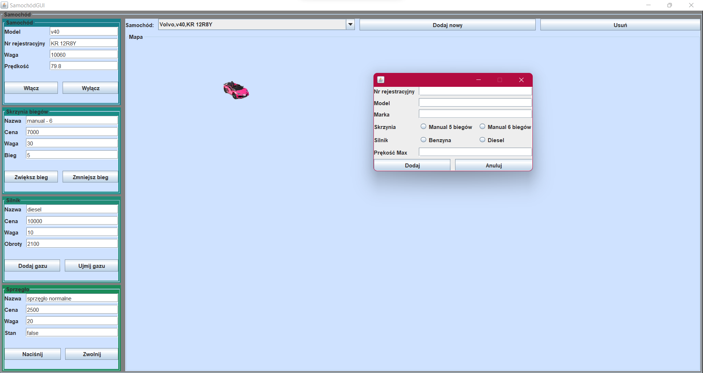

# Car-Application

This is a simple GUI application simulating driving a car. It was created during studies as a sample project.

## Features
- adding gas
- braking
- gear changing 
- pointing to a destination on the map (MouseListener)
- having a few cars at the same time
- setting car parameters 

